# Survey of Distributions

looking at relationships between distributions.

the code for the site can be found [here](https://github.com/robillersomeone/robillersomeone.github.io).

typos are normally distributed, so if you see one please let me know.

## Continuous Distributions
the starting point is the gamma in theory and code in `distributions.py`, due to the point of reference the gamma serves for other distributions.

the graphing code can be found in the viz directory, all graphs are of the probability density function for the given distribution over a subset of their support, normally [0, 20)

### normal distribution
two parameters
- mean (`μ` location parameter)
- variance (`σ^2` scale parameter)

more later on...

### gamma distribution and special cases (Pearson type III)
two parameters
- shape (`k`, positive real numbers)
- scale (`θ`, positive real numbers, `β` the inverse scale - 'rate' can also be used where `β=1/θ`)

support : `(0,∞)`

known as maximum entropy distribution
for processes with waiting times between events... like the waiting time between poisson distributed events

two constructions
- using exponentials and the gamma function for positive integers:
`Γ(k) = (k − 1)!`
- using the improper integral from `[0,∞)` for complex numbers
    - this is used to build the distributions that follow

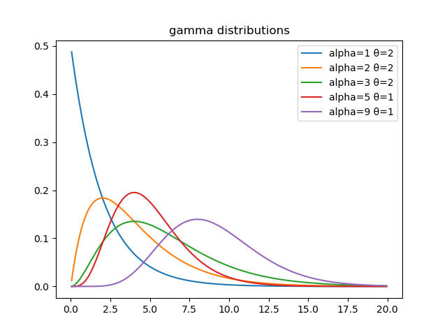

### erlang is a case of gamma
two parameters
- shape (`k` positive **integer**)
- rate (`λ` positive real number, 'scale' - reciprocal of rate (`1/λ`) can also be used)

support : `[0,∞)`

**in relation to gamma** it's the gamma distribution with the shape parameter as an integer

the sum of `k` independent exponentially distributed random variables with mean `θ`
thought of as probability distribution of waiting time until `k-th` arrival.

in relation to chi-squared, it's a chi-squared distribution with 2k degrees of freedom, when `scale=2` ~ generalized chi-squared distribution

the scale parameterization is implemented in `distributions.py` 

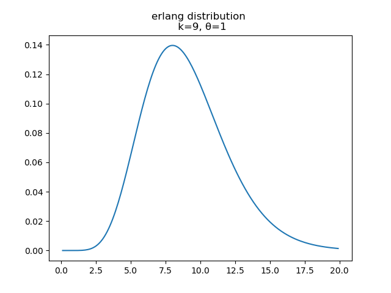

### exponential distribution (Pearson type III)
one parameter
- rate (`λ` over the interval ``[0,∞)``)

support : `[0,∞)`

**in relation to gamma**
- as an Erlang distribution with the shape parameter 'fixed' as `k=1`
  - the sum of `k` exponential distributions is an Erlang distribution with `(k,λ)`
  - by extension, as a gamma distribution
- as the probability distribution of time between events of a poisson distribution
- backwards, `n` independent and identically distributed  exponential distributions random variables  sum to a gamma distribution with shape `n` and rate `λ`

in relation to discrete distributions it's the continuous case of the geometric

has a memoryless property - past is not helpful in predicting the future.

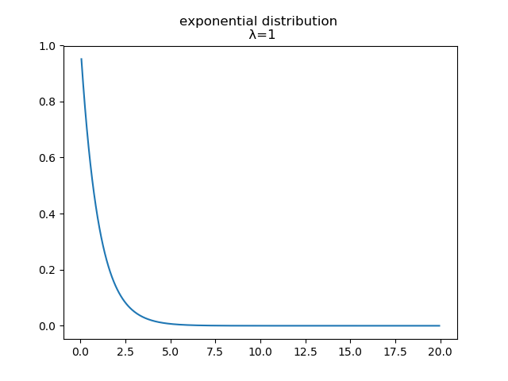

### chi-squared distribution (Pearson type III)
one parameter
- degrees of freedom (`k`, the sum of the squared of independent standard normal distributions)

support : `[0,∞)`

**in relation to gamma** chi-squared is a special case of the gamma distribution with `ν` degrees of freedom, where `gamma(ν/2 ,2) = χ2(ν)`

used in hypothesis testing, as goodness of fit and independence.

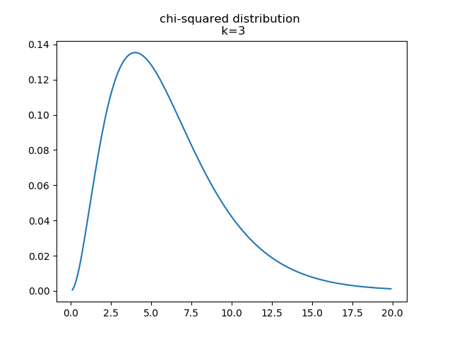

### laplace distribution
two parameters
- location (`μ` real number)
- scale (`b` real number > 0)

support : real numbers (all of 'em)

**in relation to gamma** the laplace distribution is made from the difference of two exponentials (a special case of the erlang distribution, which is a case of the gamma distribution), because of this if we take the absolute value of one laplace distribution we get a chi-square distribution, and a f-distribution if we use two laplaces distributions.

in LASSO regression, is a bayesian regression with a laplace prior.

can be thought of a composite/double distribution

related to the normal distribution
  - normal - is the squared different from the mean
  - laplace - is the absolute difference from the mean

also, check out the laplace transform, which is neat.

from laplace - the frequency of an error is an exponential function of its magnitude without the sign

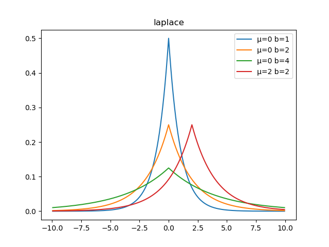

### beta distribution (Pearson type I)
two parameters
- shape (`𝛼`)
- shape (`β`)

support : `[0,1]`, so good for probabilities

'distribution over distributions', defining binomial coefficient for continuous variables

**in relation to gamma** is a gamma distribution divided by the sum of that gamma distribution with another, which takes the form `gamma(1) / (gamma(1) + gamma(2))`

 the beta *function* is the product of two iid gamma functions divided by the sum of the two random variables in a gamma function.
 
 the multivariate beta distribution is the dirichlet distribution.
 
 the beta distribution is the conjugate to binomial distribution.

here the beta distribution is symmetric, the alpha and beta parameters are equal positive integers.

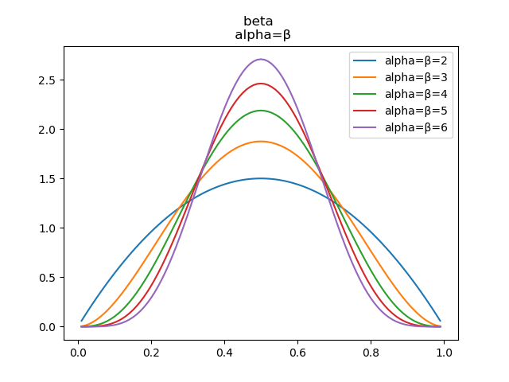

here the beta distribution is symmetric, the alpha and beta parameters are equal real numbers less than one. 

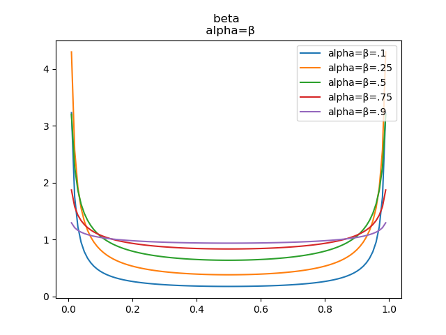

here the alpha parameter is greater than the beta parameter.

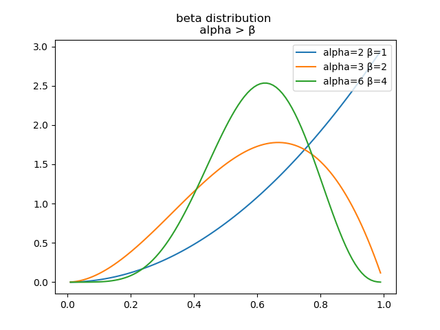

here the beta parameter is greater than the alpha parameter.

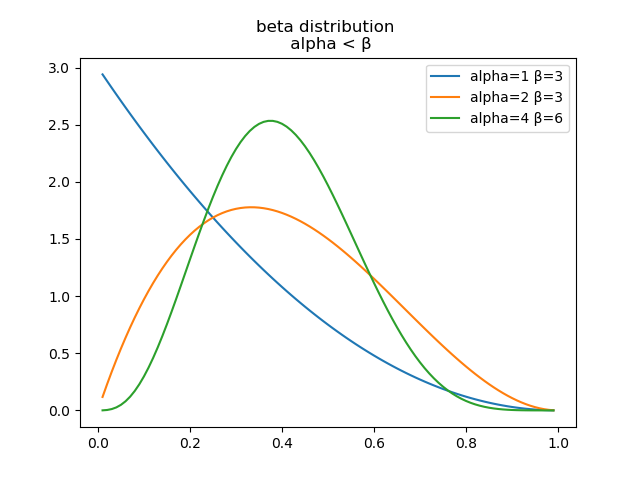

### arcsine distribution

special case of beta distribution where `Beta(.5, .5)`

**in relation to gamma** it's a type of beta distribution, which is a ratio of gamma distributions.

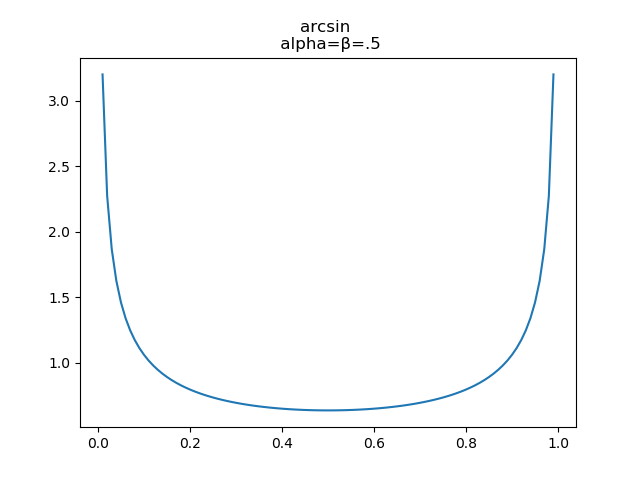

### uniform distribution

special case of beta distribution where `Beta(1, 1)`

**in relation to gamma** it's a type of beta distribution, which is a ratio of gamma distributions.

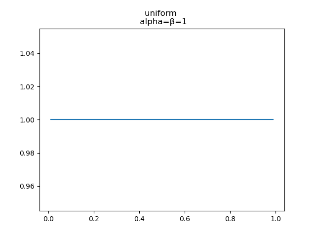

### f-distribution (Pearson type VI)
two parameters
- degrees of freedom in numerator (`n`, positive integer)
- degrees of freedom in denominator (`m`, positive integer)

support : `[0,∞)`, if `n=1` then `(0,∞)`

**in relation to gamma** f-distribution is the ratio of two chi squared distributions (where the chi-squared is a special case of the gamma distribution)

used to model ratio of sample variances, for Analysis Of Variance (ANOVA) and regression

f-distribution is also a specific parameterization of the beta prime distribution (inverted beta distribution)

used in f-test in hypothesis testing. null hypothesis ~ two independent normal variances are equal.

in the code, it's built with the gamma function tranforming the sums of the degrees of freedom as well as the individual degrees of freedom - all divided by 2, the f-distribution can be thought of as two the chi-squared parameterizations of the gamma distribution.

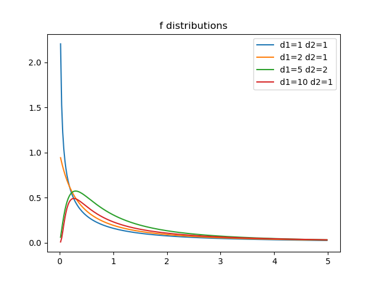

### normal distribution
two parameters
- location (`μ` mean parameter)
- scale (`σ^2` variance parameter)

support : `(-∞,∞)` real numbers

as the 'shape' parameter increases (for large `k`, or a `k -> ∞`) the gamma distribution converges to the normal distribution

**in relation to gamma** using the central limit theorem, the gamma (or any distribution with finite variance) will converge to the normal distribution

RIDGE regression, is a bayesian regression with a normal prior

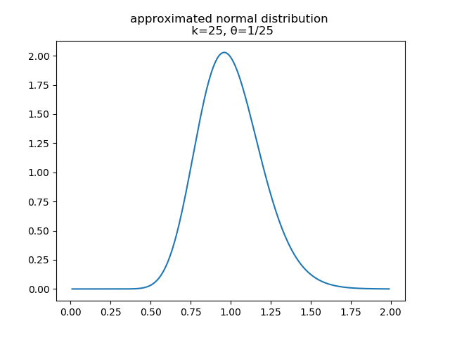

### t-distribution (Pearson type VII)
one parameters
- degrees of freedom `𝜈`

**in relation to the gamma** the probability density function is given by the gamma function with the degrees of freedom

support : `(-∞,∞)` real numbers

arises from sampling, estimate the mean of a normally distributed population
- sample size is small
- population standard deviation is unknown

### cauchy distribution (Pearson type IV)
two parameters
- location (`x` where `x` is real)
- scale (`γ` where `γ > 0`)

support : `(-∞,∞)` real numbers

**in relation to gamma** two independent standard normal divided by one another

cauchy distribution has no mean, variance, or higher moments defined.
The mode and median are defined and equal to the location parameter.

it's the fourier transform of the laplace distribution

`cauchy(0,1)` is a student's t with 1 degree of freedom `t(df=1)`, this is also called the standard cauchy distribution

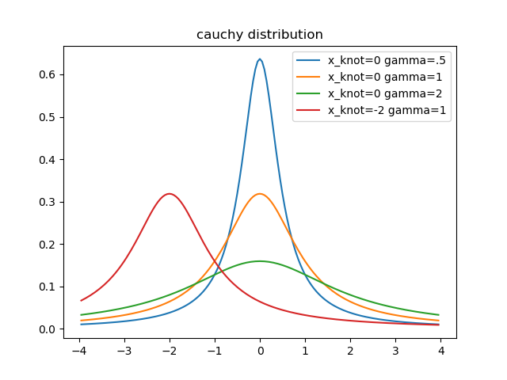

### dirichlet distribution
two parameters
- categories (`k`, where `k` is a integer ≥ 2)
- concentration (`𝛼`, where `𝛼 > 0`)

domain ~ thought of as a set of probability distrubtions

**in relation to gamma** the gamma distribution can generate random vectors that form a dirichlet distribution
- `k` independently distributed gamma distributions, each divided by `V` (the sum of the `k` distributions)

multivariate generalization of beta distribution
can be thought of as 'a distribution over distributions'
  - sampling from a dirichlet results in a distribution

symmetric dirichlet distributions - where all parameters are equal.

concentration parameter ~ how concentrated the proabability mass of from the distribution is likely to be
  - with value less than 1 the mass is concentrated in a few components.
  - value greater than 1 the mass is dispersed ~ equal in components.
  
  

### pareto distribution
two parameters
- scale (`x`, positive real number > 0)
- shape (`𝛼`, positive real number  > 0)

power-law probability distribution.

used all over the place.

**in relation to gamma** the log of a pareto distribution divided by the minimum `x sub m` is an exponential distribution (a specific parameterization of the gamma)

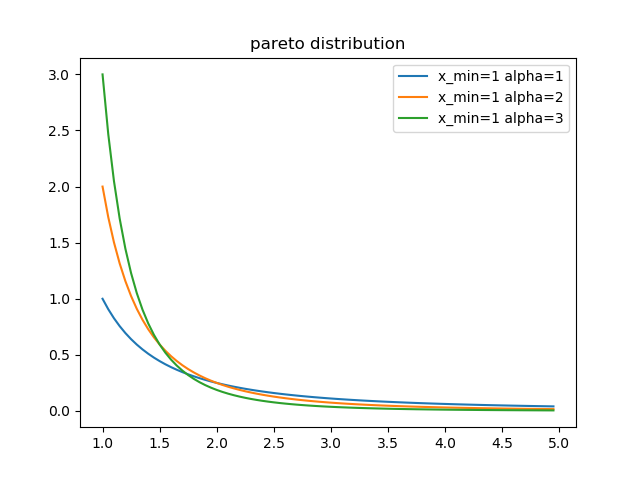

### rayleigh distribution
one paramter
- scale (`σ`, positive real number > 0)

support : `[0,∞)`

think of magnitude of uncorrelated, normally distributed components.
 
**in relation to gamma** the sum of squared rayleigh distributions is a gamma distribution with`Γ( N, 2 * σ^2 )`. 

the rayleigh distribution of `σ=1` is a chi distribution with `ν=2`, also the square of a rayleigh distribution is a chi-squared distribution with degrees of freedom `k=2`. 

finally the square root of an exponential distribution is a rayleigh distribution with `R(1/ (2λ)^1/2)`

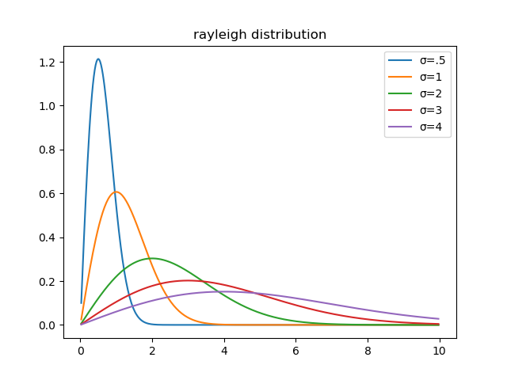

### gumbel distribution (extreme value distribution type I)
two parameters
- location (`μ` real number)
- scale (`β` real number > 0)

support : x is a real number

**in relation to gamma** its the negative log of an exponential distribution with mean=1, aka the exponential of an exponential.

it models the distribution of the maximum of a number of samples of various distrubtions (pretty meta)

its a generalization of the extreme value distribution

the difference between two gumbel distribution random variables is a logistic distribution

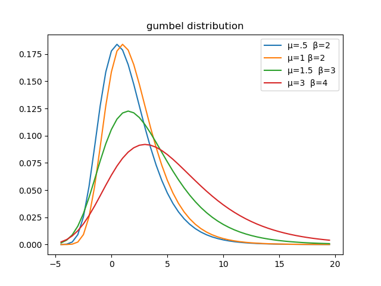

### fréchet distribution (extreme value distribution type II)
three parameters (two are optional)
- shape (`𝛼` positive real number > 0, the shape is generalized to include the location and scale)
- scale (`s=1` positive real number > 0, default value is 1, so is optional to change)
- location of minimum (`m=0` real number, default value is 0, so it optional to change)

support : `x > m`, for a random variable greater than the minimum

**in relation to gamma** its the negative log of a uniform distribution raised to the negative `1/𝛼`

if the location of the minimum is 0, then the reciprocal is a weibull distribution

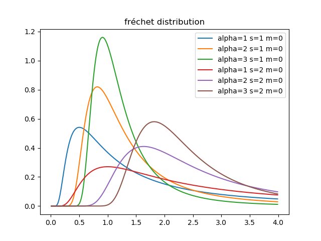

### weibull distribution (reversed weibull is extreme value distribution type III)
two parameters
- shape (`λ` real number > 0)
- scale (`k` real number > 0)

support : `[0,∞)`

**in relation to gamma** it is an exponential distribution divided by the shape, raised to the scale parameter.

the weibull distribution is also the negative natural log of the uniform distribution raised to 1 divided by the scale, all multiplied by the shape

when `k=2` the weibull distribution is a rayleigh distribution with `σ=λ/√2`

weibull distribution is the maximum entropy distribution 

the weibull distribution can be thought of as the failure rate proportional to a power of time `k`
- `k<1` the failure rate decreases over time
- `k=1` constant failure rate
- `k>1`failure rate increases over time

there is also a three parameter weibull distribution, with a location parameter `θ` that is the time before the failure (weibull) process begins

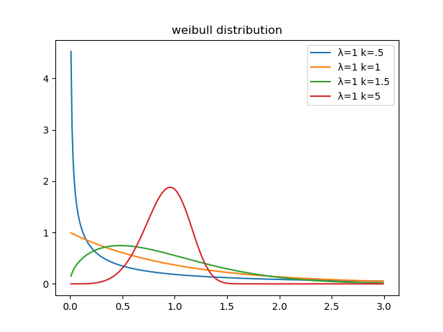

### lévy distribution
two parameter
- location (`μ`)
- scale (`c>0`)

support : `[μ,∞)`

**in relation to gamma** the levy distribution with the `location=0` is an inverse gamma distribution with `shape=1/2`

the inverse of normal distribution minus location parameter is the levy distribution

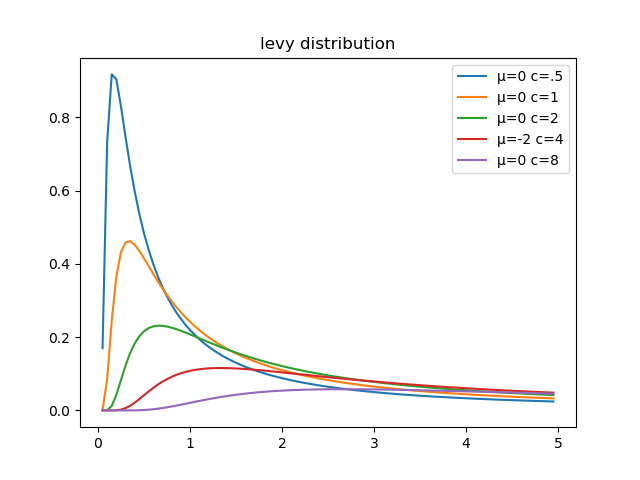

## Discrete Distributions
starting with the negative binomial distribution, due to relationship with gamma

### negative binomial
two parameters
 - number of failures ('r' where `r > 0`)
 - probability of success (`p`, for each experiment)

number of successes in a sequence of independent and identically distributed (iid) **Bernoulli** trials before `r` failures

can view the negative binomial as **poisson** distribution with `λ` being a random variable with a gamma distribution with shape `r` and scale `θ = p/(1-p)`

under certain parameters the negative binomial converges to the poisson

### mulitnomial distribution
two parameters
- number of trial (`n>0` positive integer)
- event probabilities (`p1, p2, ...` the probabilities sum to 1)

support : 

it's a generalization of the binonmial distribution

### zeta distribution
parameters
- rate? (`s`, where `s`> 1)

which is made from the riemann zeta function

support : positive integers

### yule-simon distribution
one parameter
- shape (`p>0`)

support : positive integers

## To add

### pearson distributions
four (or more) continuous distributions

type I ~ generalized beta distribtuion

type II ~ symmetric type I distributions

type III ~ generalized gamma distribution ~ chi-squared

type IV ~ cauchy distribution

type V ~ inverse gamma distribution

type VI ~ f-distribution or a beta prime

type VII ~ t-distribution

getting normal ~ take the limit of a I, III, IV, V, or VI distribution.

### tweedie distribution

### tukey lambda distribution

## support section

distribution | support | support for vis | ideally
------------ | ------- | --------------- | -------
gamma        | [0,∞)   | (0,20]          | (0,20)
erlang       | [0,∞)   | (0,20]          | (0,20)
exponential  | [0,∞)   | (0,20]          | (0,20)
chi-squared  | [0,∞)   | (0,20]          | (0,20) 
laplace      | real numbers | (0,20)     | (-10,10)
beta         | [0,1]   | (0,1)           | (0,1)
arcsine      | [0,1]   | (0,1)           | (0,1)
uniform      | [0,1]   | (0,1)           | (0,1)
f            | [0,∞)   | (0,5)           | (0,5)
normal       | real numbers | (0,5)      | (-5,-5)
t            | real numbers | (0,5)      | (-5,-5)
cauchy       | real numbers | (0,5)      | (-4,4)
dirichlet    |
pareto       | [x_min,∞) | (0,5)         | (0,5)
rayleigh     | [0,∞)   | (0,5)           | (0,10)
gumbel       | real numbers | (0, 20)    | (-5,20)
fréchet      |  x > m  | (0,5)           | (0,5)
weibull      | [0,∞)   | (0,5)           | (0,2.5)
lévy         | [μ,∞)   | (0,5)           | (0,5)

## Sources

[wiki list of distributions](https://en.wikipedia.org/wiki/List_of_probability_distributions)
