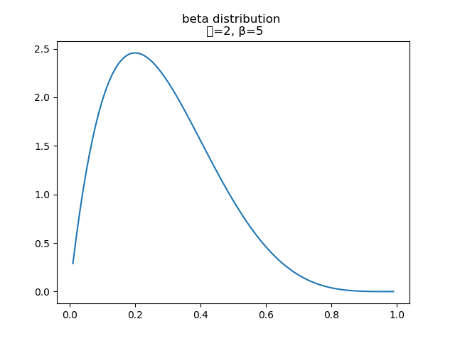

# Survey of Distributions

looking at relationships between distributions.

the code for the site can be found [here](https://github.com/robillersomeone/robillersomeone.github.io).

typos are normally distributed, so if you see one please let me know.

## Continuous Distributions
the starting point is the gamma in theory and code in `distributions.py`, due to the point of reference the gamma serves for other distributions.

the graphing code can be found in the viz directory, all graphs are of the probability density function for the given distribution over a subset of their support, normally [0, 20)

### normal distribution
two parameters
- mean (`μ` location parameter)
- variance (`σ^2` scale parameter)

### gamma distribution and special cases (Pearson type III)
two parameters
- shape (`k`, positive real numbers)
- scale (`θ`, positive real numbers, `β` the inverse scale - 'rate' can also be used where `β=1/θ`)

known as maximum entropy distribution
for processes with waiting times between events... like the waiting time between poisson distributed events

two constructions
- using exponentials and the gamma function for positive integers:
`Γ(k) = (k − 1)!`
- using the improper integral from `[0,∞)` for complex numbers
    - this is used to build the distributions that follow

### erlang is a case of gamma
two parameters
- shape (`k` positive **integer**)
- rate (`λ` positive real number, 'scale' - reciprocal of rate (`1/λ`) can also be used)

**in relation to gamma** it's the gamma distribution with the shape parameter as an integer

the sum of `k` independent exponentially distributed random variables with mean `θ`
thought of as probability distribution of waiting time until `k-th` arrival.

in relation to chi-squared, it's a chi-squared distribution with 2k degrees of freedom, when `scale=2` ~ generalized chi-squared distribution

the scale parameterization is implemented in `distributions.py` 

### exponential distribution (Pearson type III)
one parameter
- rate (`λ` over the interval ``[0,∞)``)

**in relation to gamma**
- as an Erlang distribution with the shape parameter 'fixed' as `k=1`
  - the sum of `k` exponential distributions is an Erlang distribution with `(k,λ)`
  - by extension, as a gamma distribution
- as the probability distribution of time between events of a poisson distribution
- backwards, `n` independent and identically distributed  exponential distributions random variables  sum to a gamma distribution with shape `n` and rate `λ`

in relation to discrete distributions it's the continuous case of the geometric

has a memoryless property - past is not helpful in predicting the future.

### chi-squared distribution (Pearson type III)
one parameter
- degrees of freedom (`k`, the sum of the squared of independent standard normal distributions)

**in relation to gamma** chi-squared is a special case of the gamma distribution with `ν` degrees of freedom, where `gamma(ν/2 ,2) = χ2(ν)`

used in hypothesis testing, as goodness of fit and independence.

### beta distribution (Pearson type I)
two parameters
- shape (`𝛼`)
- shape (`β`)

'distribution over distributions', defining binomial coefficient for continuous variables

**in relation to gamma** is a gamma distribution divided by the sum of that gamma distribution with another, which takes the form `gamma(1) / (gamma(1) + gamma(2))`

 the beta function is the product of two iid gamma functions divided by the sum of the two random variables in a gamma function.

 

### f-distribution (Pearson type VI)
two parameters
- degrees of freedom in numerator (`n`, positive integer)
- degrees of freedom in denominator (`m`, positive integer)

**in relation to gamma** f-distribution is the ratio of two chi squared distributions (where the chi-squared is a special case of the gamma distribution)

used to model ratio of sample variances, for Analysis Of Variance (ANOVA) and regression

f-distribution is also a specific parameterization of the beta prime distribution (inverted beta distribution)

used in f-test in hypothesis testing. null hypothesis ~ two independent normal variances are equal.

in the code, it's built with the gamma function tranforming the sums of the degrees of freedom as well as the individual degrees of freedom - all divided by 2, the f-distribution can be thought of as two the chi-squared parameterizations of the gamma distribution.

### normal distribution
two parameters
- location (`μ` mean parameter)
- scale (`σ^2` variance parameter)

as the 'shape' parameter increases (for large `k`, or a `k -> ∞`) the gamma distribution converges to the normal distribution

**in relation to gamma** using the central limit theorem, the gamma (or any distribution with finite variance) will converge to the normal distribution

### t-distribution (Pearson type VII)
one parameters
- degrees of freedom `𝜈`

**in relation to the gamma** the probability density function is given by the gamma function with the degrees of freedom

arises from sampling, estimate the mean of a normally distributed population
- sample size is small
- population standard deviation is unknown

### cauchy distribution (Pearson type IV)
two parameters
- location (`x` where `x` is real)
- scale (`γ` where `γ > 0`)

two independent standard normal divided by one another

cauchy distribution has no mean, variance, or higher moments defined.
The mode and median are defined and equal to the location parameter.

`cauchy(0,1)` is a student's t with 1 degree of freedom `t(df=1)`, this is also called the standard cauchy distribution

### dirichlet distribution
two parameters
- categories (`k`, where `k` is a integer ≥ 2)
- concentration (`𝛼`, where `𝛼 > 0`)

domain ~ thought of as a set of probability distrubtions

**in relation to gamma** the gamma distribution can generate random vectors that form a dirichlet distribution
- `k` independently distributed gamma distributions, each divided by `V` (the sum of the `k` distributions)

multivariate generalization of beta distribution
can be thought of as 'a distribution over distributions'
  - sampling from a dirichlet results in a distribution

symmetric dirichlet distributions - where all parameters are equal.

concentration parameter ~ how concentrated the proabability mass of from the distribution is likely to be
  - with value less than 1 the mass is concentrated in a few components.
  - value greater than 1 the mass is dispersed ~ equal in components.
  
  

### pareto distribution
two parameters
- scale (`x`, positive real number > 0)
- shape (`𝛼`, positive real number  > 0)

power-law probability distribution.

used all over the place.

**in relation to gamma** the log of a pareto distribution divided by the minimum `x sub m` is an exponential distribution (a specific parameterization of the gamma)

### Rayleigh distribution
one paramter
- scale (`σ`, positive real number > 0)

think of magnitude of uncorrelated, normally distributed components.
 
**in relation to gamma** the sum of squared rayleigh distributions is a gamma distribution with`Γ( N, 2 * σ^2 )`. the rayleigh distribution of `σ=1` is a chi distribution with `ν=2`, also the square of a rayleigh distribution is a chi-squared distribtuion with degrees of freedom `k=2`. finally the square root of an exponential distribution is a rayleigh distribution with `R(1/ (2λ)^1/2)`

## Discrete Distributions
starting with the negative binomial distribution, due to relationship with gamma

### negative binomial
parameters
 - number of failures ('r' where `r > 0`)
 - probability of success (`p`, for each experiment)

number of successes in a sequence of independent and identically distributed (iid) **Bernoulli** trials before `r` failures

can view the negative binomial as **poisson** distribution with `λ` being a random variable with a gamma distribution with shape `r` and scale `θ = p/(1-p)`

under certain parameters the negative binomial converges to the poisson

### zeta distribution
parameters
- rate? (`s`, where `s`> 1)

which is made from the riemann zeta function

support
- positive integers

## To add

### Pearson distributions
four continuous distributions

type I ~ generalized beta distribtuion

type II ~ symmetric type I distributions

type III ~ generalized gamma distribution ~ chi-squared

type IV ~ cauchy distribution

type V ~ inverse gamma distribution

type VI ~ f-distribution or a beta prime

type VII ~ t-distribution

getting normal ~ take the limit of a I, III, IV, V, or VI distribution.
### Tweedie distribution

### yule-simon distribution

### lévy distribution

## Sources

[wiki list of distribitions](https://en.wikipedia.org/wiki/List_of_probability_distributions)
